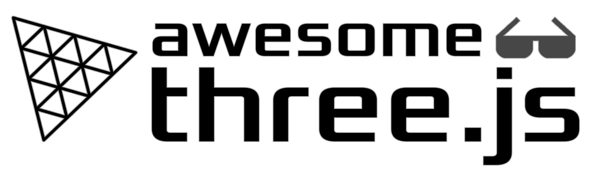

I've been developing website and applications for 6 years. In that period, I got a opportunity to work for startups and larger companies,  taking ideas and delivering functional reliable apps that meet customer requirements.

I provide seamless code with good testing  
To bring the 100% satisfication of client is my goal. 
Full-time freelancer who responds anytime and works anytime - it's me! 😎 

&nbsp;

<h3 align="left">Languages and Tools:</h3>

                                          

